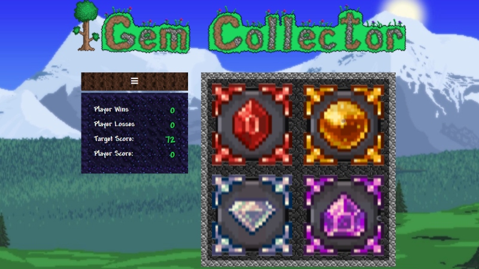

# Crystal Collector Game

Deployed Site: [bryanbloomquist.com/crystal-collector](https://bryanbloomquist.com/crystal-collector)

## Overview

Crystal Collector game is a simple number matching game using HTML, CSS, Javascript, and jQuery.

## Requirements

Here's how the app works:

  * There will be four crystals displayed as buttons on the page.

  * The player will be shown a random number at the start of the game.

  * When the player clicks on a crystal, it will add a specific amount of points to the player's total score. 

    * Your game will hide this amount until the player clicks a crystal.
    * When they do click one, update the player's score counter.

  * The player wins if their total score matches the random number from the beginning of the game.

  * The player loses if their score goes above the random number.

  * The game restarts whenever the player wins or loses.

    * When the game begins again, the player should see a new random number. Also, all the crystals will have four new hidden values. Of course, the user's score (and score counter) will reset to zero.

  * The app should show the number of games the player wins and loses. To that end, do not refresh the page as a means to restart the game.

## Game Design Notes

* The random number shown at the start of the game should be between 19 - 120.

* Each crystal should have a random hidden value between 1 - 12.

## My Improvements

Here are some of the improvements I added to go beyond a simple match game.

* The mouse is replaced with a little pixelated pickaxe that, when clicked on a gem, not only animates by makes a rock chipping noise.

* When you match the score you rescue one of the town NPC's from Terraria and he or she is added to score board at the bottom of the screen, see if you can rescue Santa.

* The gems not only change value each round, but they change color too.

* The logo was made at terraria-logo-maker.darthmorf.tk

* The rest of the art (borders, background images, gems, NPCs) were taken from the game and then edited by me.

* The font (Andy) is the same font used in Terraria.

## Screenshot

